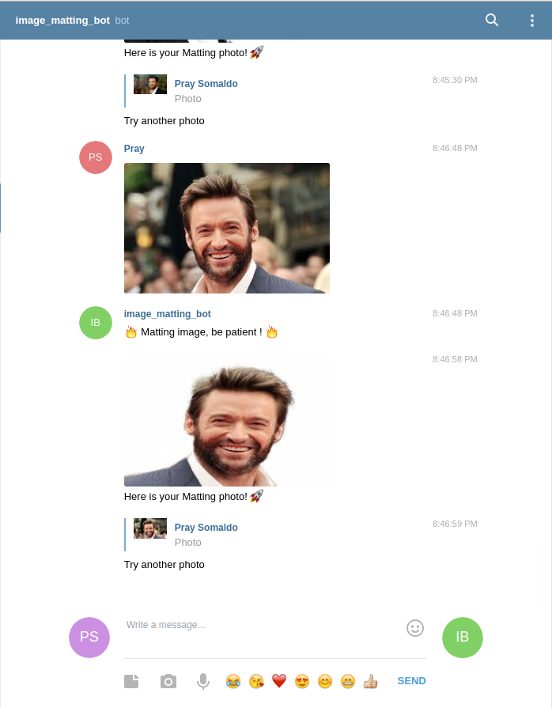

# Telegram Image Matting Bot 

A telegram  bot that extract person from background. It can be useful for background changing through telegram app easily.




## Requirements
```
numpy==1.13.3
torch==1.2.0
requests==2.18.4
opencv_contrib_python==4.4.0.42
torchvision==0.4.0
Flask==1.1.2
Pillow==8.1.0
pyTelegramBotAPI==3.7.6
python-dotenv==0.15.0
```
## Script contains:
### server.py  
> Contains server logic and delivers telegram updates to bot logic.  

### bot.py  
> Holds bot logic isolated from server code, can be expanded without touching server.

## Run app
```
python3 server.py
```

## To-do
- add option to chnage color background
- provide video matting option
## Credits
- [Alain Perkaz](https://aperkaz.github.io)
- [telegram-unsplash-bot](https://github.com/aperkaz/telegram-unsplash-bot)
- [MODNet](https://github.com/ZHKKKe/MODNet)